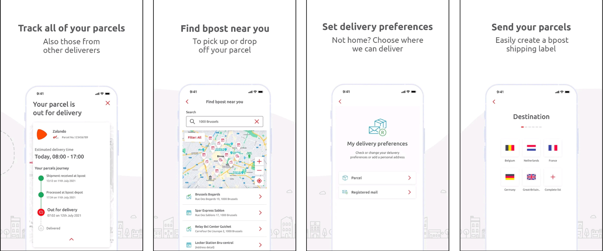
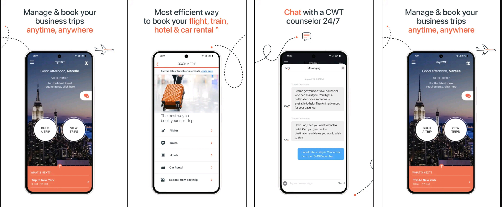
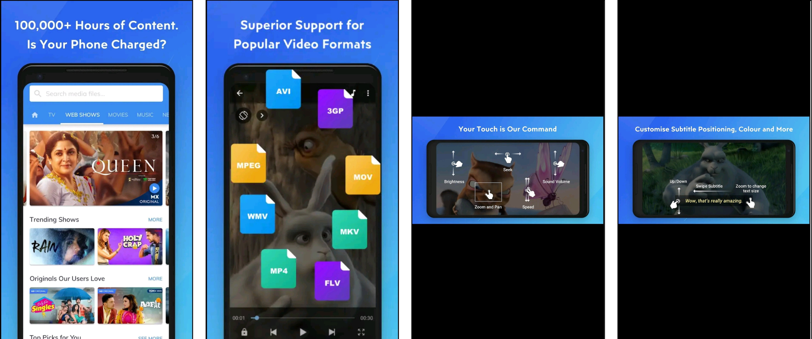
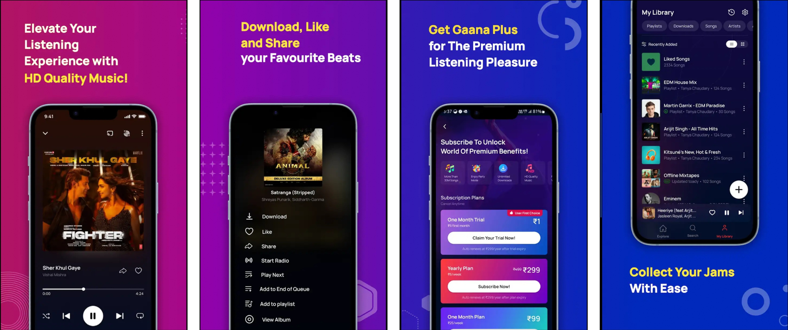
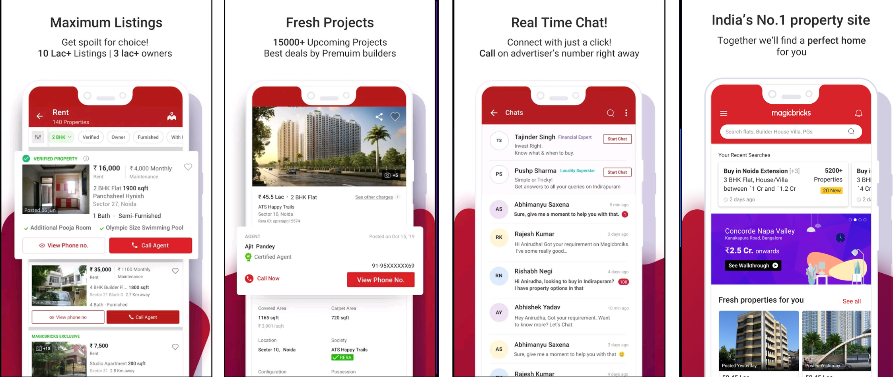
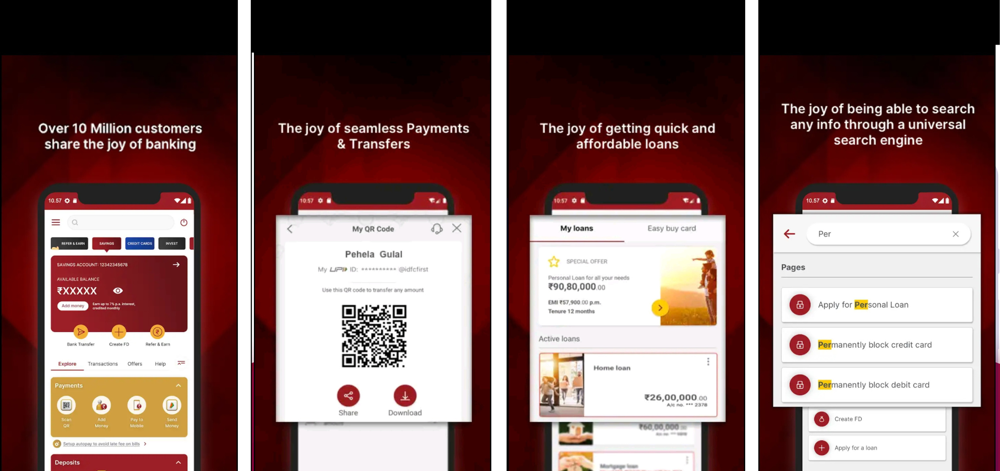
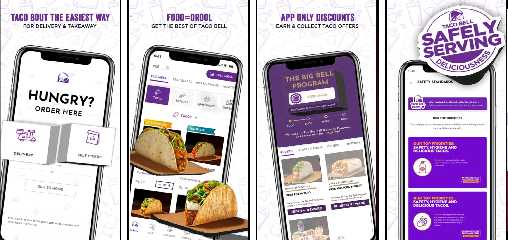
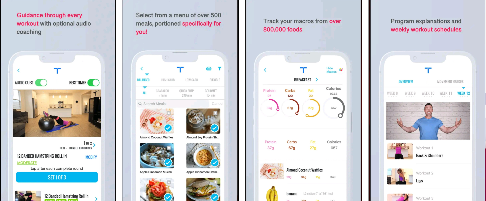
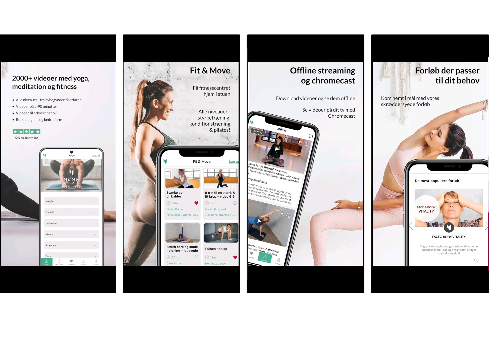

# Sunil

### Hello, my name is Sunil, and I am an experienced Android Developer with over 7 years of experience in Native app development. Throughout my career, I have created more than 10 Android apps independently. My main objective is to deliver a seamless, user-friendly, and error-free application to my clients. I am well-versed in providing best-practice solutions, clean architectures, and bug-free applications that help businesses grow.

✔️ Develop new modules to meet specific client requirements.

✔️ I can help you with troubleshooting, debugging, and upgrading your existing software.

✔️ Provide the most effective solution or approach to implement in the application.

✔️ Collaborate with developers to create algorithms and flowcharts for software development.

✔️ Integrate software components and third-party programs.

&nbsp;&nbsp;&nbsp;&nbsp;&nbsp;&nbsp;</a>
### Technolgies : Android SDK , Kotlin,ChatGPT, Architecture Pattern(MVVM, MVP, MVC),Jetpack Components(Jetpack compose, Room, WorkManager, ViewModel, LiveData, Paging), Jetpack compose, Navigation component, Hilt, Coroutines, RxJava, Dagger2, Lottie, Butter Knife, QR Code, Retrofit, Volley, Push Notifications, SQLITE, Social Integration, Payment integrations, Analytics, Unit Test Cases, EventBus

# My bpost Application

The most popular all-round parcel app in Belgium. All your online orders and shipments are at your fingertips: track them closely, choose where they’re delivered and get them ready for shipment in no time

&nbsp;&nbsp;&nbsp;&nbsp;&nbsp;

# myCWT Application

myCWT™ allows you to plan, book and track your travel itinerary. myCWT™ is your business travel companion - plan, book, manage and track your travel. Manage your flight, hotel and car rental bookings all in one place. Get real-time alerts on updated flight changes, weather conditions and more. Automatically sync your travel itinerary into your calendar and your meetings into the app. Quickly and conveniently chat with a CWT travel counselor for all your travel-related needs.

&nbsp;&nbsp;&nbsp;&nbsp;&nbsp;

# MX Player Beta Application

MX Player, the most powerful video player now brings you a FREE streaming service offering more than 100,000+ hours of content including Original & Exclusive Shows, Movies, TV Shows, Web Series & a dual Music experience with videos and audio.

&nbsp;&nbsp;&nbsp;&nbsp;&nbsp;

# Gaana Music Application

Gaana.com- Listen & Download latest MP3 songs online. Download new or old Hindi songs, Bollywood songs, English songs* & more on Gaana+ and play offline.

&nbsp;&nbsp;&nbsp;&nbsp;&nbsp;

# Magicbricks Application

magicbricks is a high-end property portal that caters to a global market with its unique services and novel online features. Having been launched in the year 2006 by Times Group, Magicbricks has quickly risen to being the No. 1 Property Portal in India. The Magicbricks design is based on rigorous research, unique product developments, and innovative initiative which has been readily accepted by users. In an attempt to best serve the users, features on the Magicbricks realty portal are constantly invented, evaluated and upgraded.  In addition to all else, magicbricks.com is synonymous with internationally acclaimed property fairs. It is here that top-notch properties of major Indian metros are showcased for audiences in India and abroad.  Till date, magicbricks.com has successfully hosted 75 domestic and over 15 international property shows around the globe.

&nbsp;&nbsp;&nbsp;&nbsp;&nbsp;

# IDFC FIRST Bank: MobileBanking Application

Welcome to IDFC FIRST Bank’s Mobile Banking App. Enjoy a fast and
seamless online banking experience, with integrated banking services
and exciting features.
Experience the joy of
* One-Swipe Banking: Swipe to view your account balances and
  manage credit card/debit card details, deposits, investments, etc.
* Seamless Payments & Transfers: Make secure payments, UPI transfers,
  and bill payments instantly.
* Zero Fee Banking: Enjoy over 28 commonly used Savings Account
  services free of cost, including money transfers, cheque re-issuance,
  debit card issuance, ATM withdrawals, etc.
* Building Wealth: One screen to view your investment portfolio. Get
  curated investment recommendations based on your risk profile.
* Being in Control: Track, analyse and manage your expenses across
  categories
* Investing for your Life Goals: Choose your investment goals – be it a
  wedding, children’s education, or retirement. Also, create goals with
  curated recommendations.
* Personalized Offers: Get exciting offers you can use across dining,
  lifestyle, travel and more. Find what you are looking for with our
  suggestive in-app features.
* Affordable Instant Loans: Avail pre-approved loan offers at attractive
  interest rates and flexible tenures.

&nbsp;&nbsp;&nbsp;&nbsp;&nbsp;

# Taco Bell IN Application

The world's leading Mexican-inspired restaurant brand, is all set to offer its fans another fantastic avenue to gorge on their favourites from the brand. Yes, you read that right!

&nbsp;&nbsp;&nbsp;&nbsp;&nbsp;

# Transformation with Chris Application

Join Chris Powell, trainer and host of the worldwide hit TV show ‘Extreme Weight Loss,’ as he guides you through a complete transformation experience. From custom meal plans to macro tracking to thousands of workouts, Chris and the Transform Team will lead the way to a healthier and happier you!

&nbsp;&nbsp;&nbsp;&nbsp;&nbsp;

# Yogavivo Application

With Yogavivo users will not be out of the door even when one has finally returned home. Yogavivo is Denmark's largest yoga universe with 650+ yoga videos with the most renowned Danish yoga Teacher. Yogavivo gives its users yoga breaks in 5-90min - via video directly on one’s tablet or Smartphone

&nbsp;&nbsp;&nbsp;&nbsp;&nbsp;

## Thanks for stopping by!
  

   LICENCE
-----

 Copyright 2022 Sunil

    Licensed under the Apache License, Version 2.0 (the "License");
    you may not use this file except in compliance with the License.
    You may obtain a copy of the License at

        http://www.apache.org/licenses/LICENSE-2.0

    Unless required by applicable law or agreed to in writing, software
    distributed under the License is distributed on an "AS IS" BASIS,
    WITHOUT WARRANTIES OR CONDITIONS OF ANY KIND, either express or implied.
    See the License for the specific language governing permissions and
    limitations under the License.
